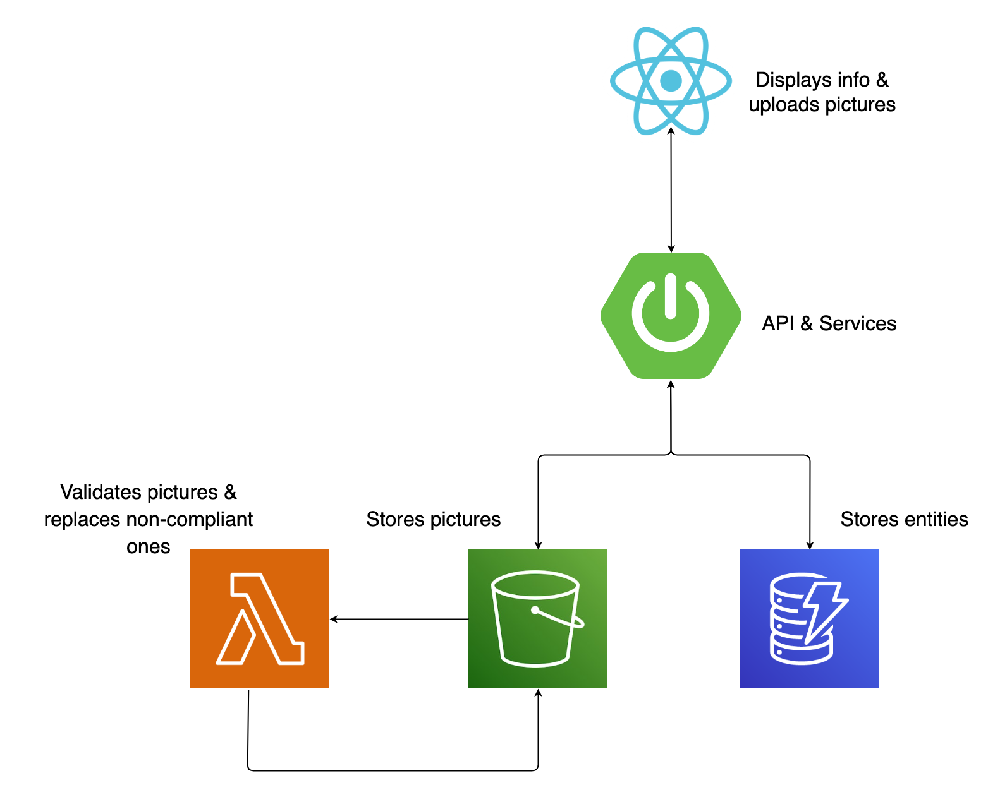

# Shipment List Demo Application - AWS in PROD and LocalStack on DEV environment


| Environment      |   |
|------------------|--------------------------------------------------------------------------------------------------------------------------------------------------------------------------------------------------------------------------------------------------------------------------------------------------------------------------------------------------------------------------------------------------------------------------------------------------------------------------------------------------------------------------------------------------------------------------------------------------------------------------------------------------------------------------------------------------------------------------------------------------------------------------------------------------------------------------------------------------------------------------------------------------------------------------------------------------------------------------------------------------------------------------------------------------------------------------------------------------------------------------------------------------------------------------------------------------------------------------------------------------------------------------------------------------------------------------------------------------------------------------------|
| __Services__     | Amazon S3, Lambda, DynamoDB, SNS, SQS                                                                                                                                                                                                                                                                                                                                                                                                                                                                                                                                                                                                                                                                                                                                                                                                                                                                                                                                                                                                                                                                                                                                                                                                                                                                                                                                          |
| __Integrations__ | AWS SDK, Terraform, AWS CLI                                                                                                                                                                                                                                                                                                                                                                                                                                                                                                                                                                                                                                                                                                                                                                                                                                                                                                                                                                                                                                                                                                                                                                                                                                                                                                                                                    |
| __Categories__   | Spring Boot, S3 Trigger                                                                                                                                                                                                                                                                                                                                                                                                                                                                                                                                                                                                                                                                                                                                                                                                                                                                                                                                                                                                                                                                                                                                                                                                                                                                                                                                                        |
| __Level__        | Intermediate                                                                                                                                                                                                                                                                                                                                                                                                                                                                                                                                                                                                                                                                                                                                                                                                                                                                                                                                                                                                                                                                                                                                                                                                                                                                                                                                                                   |
| __Works on__     | LocalStack v2                                                                                                                                                                                                                                                                                                                                                                                                                                                                                                                                                                                                                                                                                                                                                                                                                                                                                                                                                                                                                                                                                                                                                                                                                                                                                                                                                                  |


### UPDATE

The Terraform configuration file now randomly generates names for the bucket, in order to avoid conflicts
at a global scale on AWS. This name shall be written out to a properties file, which the app will pick up
and use for the S3 client. Furthermore, the name is also passed as an environment variable to the Lambda function by Terraform,
so there's no need to worry about managing it.


## Introduction

This application was created for demonstration purposes to highlight the ease of switching from
using actual AWS dependencies to having them emulated on LocalStack for your *developer environment* .
Of course this comes with other advantages, but the first focus point is making the transition.

## Architecture Overview



## Prerequisites

- [Maven 3.8.5](https://maven.apache.org/install.html) & [Java 17](https://www.java.com/en/download/help/download_options.html)
- [AWS free tier account](https://aws.amazon.com/free/)
- [LocalStack](https://localstack.cloud/)
- [Docker](https://docs.docker.com/get-docker/) - for running LocalStack
- [Terraform](https://developer.hashicorp.com/terraform/tutorials/aws-get-started/install-cli) (+ Python pip for [tflocal](https://pypi.org/project/terraform-local/)) for creating AWS & LocalStack resources
- [npm](https://docs.npmjs.com/downloading-and-installing-node-js-and-npm) - for running the frontend app

#### What it does

*shipment-list-demo* is a Spring Boot application dealing with CRUD operations a person can
execute
on a bunch of shipments that they're allowed to view - think of it like the Post app.
The demo consists of a backend and a frontend implementation, using React to display the
information.
The AWS services involved are:

- [S3](https://docs.localstack.cloud/user-guide/aws/s3/) for storing pictures
- [DynamoDB](https://docs.localstack.cloud/user-guide/aws/dynamodb/) for the entities
- [Lambda](https://docs.localstack.cloud/user-guide/aws/lambda/) function that will validate the pictures, apply a watermark and replace non-compliant files.
- [SNS](https://docs.localstack.cloud/user-guide/aws/sns/) that receives update notifications
- [SQS](https://docs.localstack.cloud/user-guide/aws/sqs/) that subscribes to a topic and delivers the messages to the Spring Boot app


#### How to use it

We’ll be walking through a few scenarios using the application, and we expect it to maintain the
behavior in both production (AWS) and development (LocalStack) environments.

We’ll take advantage of one of the core features of the Spring framework that allows us to bind our
beans to different profiles, such as dev, test, and prod. Of course, these beans need to know how to
behave in each environment, so they’ll get that information from their designated configuration
files, `application-prod.yml`, and  `application-dev.yml`.

#### Terraform

The Terraform configuration file will create the needed S3 bucket, the DynamoDB `shipment` table and populate it with some
sample data, the Lambda function that will help with the picture processing (make sure you create the jar),
the SQS and SNS which will bring back the notification when the processing is finished.


## Instructions

### Only run once

The following instructions only need to run once, weather you choose to run both cases, on AWS and
LocalStack, or just jump straight to LocalStack.

### Building the validator module

Step into the `shipment-picture-lambda-validator` module and run `mvn clean package shade:shade`.
This will create an uber-jar by packaging all its dependencies. We'll need this one in the next
steps. We can keep the same jar for both running on AWS and LocalStack.


### Running the GUI

`cd` into `src/main/shipment-list-frontend` and run `npm install` and `npm start`.
This will spin up the React app that can be accessed on `localhost:3000`.
You'll only see the title, as the backend is not running yet to provide the list of shipments.

For running it on Windows, there are some
[extra requirements](https://learn.microsoft.com/en-us/windows/dev-environment/javascript/react-on-windows)
,
but no worries, it should be straightforward.

#### How to use the GUI

After starting the backend, refreshing the React app will fetch a list of shipments.
The weight of a shipment is already given, but not the size, that's why we need pictures to
understand it better, using the "banana for scale" measuring unit. How else would we know??

Current available actions using the GUI:

- upload a new image
- delete shipment from the list
- create and update shipment are available only via Postman (or any other API platform)

Files that are not pictures will be deleted
and the shipment picture will be replaced with a generic icon, because we don't want any trouble.


## Running on AWS

Now, we don’t have a real production environment because that’s not the point here, but most likely
an application like this runs on a container orchestration platform, and all the necessary configs
are still provided. Since we’re only simulating a production instance, all the configurations are
kept in the `application-prod.yml` file.

### User credentials

Before getting started, it's important to note that an IAM user, who's credentials will be used,
needs to be created with the following policies:

- AmazonS3FullAccess
- AWSLambda_FullAccess
- AmazonDynamoDBFullAccess
- AmazonSNSFullAccess
- AmazonSQSFullAccess
- AWSLambdaExecute
- AmazonS3ObjectLambdaExecutionRolePolicy

For simplicity, we chose to use full access to all the services, so we don't have to add new permissions later on.
We will be using the user's credentials and export them as temporary environment variables with the
`export` (`set` on Windows) command:

```
$ export AWS_ACCESS_KEY_ID=[your_aws_access_key_id]
$ export AWS_SECRET_ACCESS_KEY=[your_aws_secret_access_key_id]
```

### Creating resources - running Terraform

Make sure you have Terraform [installed](https://developer.hashicorp.com/terraform/downloads)

Under `terraform` run:

```
$ terraform init
$ terraform plan
```

Once these 2 commands run successfully and no errors occur, it's time to run:

```
$ terraform apply
```
If everything finishes successfully, the AWS services should be up and running.

### Starting the backend

Go back to the root folder and run the backend simply by using

```
$ mvn spring-boot:run -Dspring-boot.run.profiles=prod
```

Notice the `prod` profile is being set via command line arguments.

### Using the application

At `localhost:3000` you should now be able to see a list of shipments with standard icons,
that means that only the database is populated, the pictures still need to be added from the
`sample-pictures` folder.
You can now interact with the application using the React app. All services used in the backend are
running on the real AWS cloud.


Before moving on, make sure you clean up your AWS resources by running (also in the `terraform` folder):

```
$ terraform destroy
```

## Running on LocalStack


To switch to using LocalStack instead of AWS services just run `docker compose up` in the root
folder to spin up a Localstack container.

### Creating resources on LocalStack

To generate the exact same resources on LocalStack, we need `tflocal`, a thin wrapper script around
the terraform command line client. `tflocal` takes care of automatically configuring the local
service
endpoints, which allows you to easily deploy your unmodified Terraform scripts against LocalStack.

You can [install](https://docs.localstack.cloud/user-guide/integrations/terraform/) the `tflocal`
command via pip (requires a local Python installation):

```
$ pip install terraform-local
```

Once installed, the `tflocal` command should be available, with the same interface as the terraform
command line. Try it out:

```
$ tflocal --help
Usage: terraform [global options] <subcommand> [args]
...
```

From here on, it's the same as using AWS. In the `terraform` folder, run the `cleanup` script
to get rid of any files that keep track of the resources' state. Then:

```
$ tflocal init
$ tflocal plan
$ tflocal apply
```

We run the exact same commands for the exact same file. We no longer need to pass any environment 
variables, since the bucket name is generated and passed by Terraform.

### Starting the backend

After that, the Spring Boot application needs to start using the dev profile (make sure you're in
the
root folder):

```
$ mvn spring-boot:run -Dspring-boot.run.profiles=dev
```
### Using the application

Go back to `localhost:3000` and a new list will be available; notice that the functionalities of
the application have not changed.

There you have it, smooth transition from AWS to Localstack, with no code change. 👍🏻


